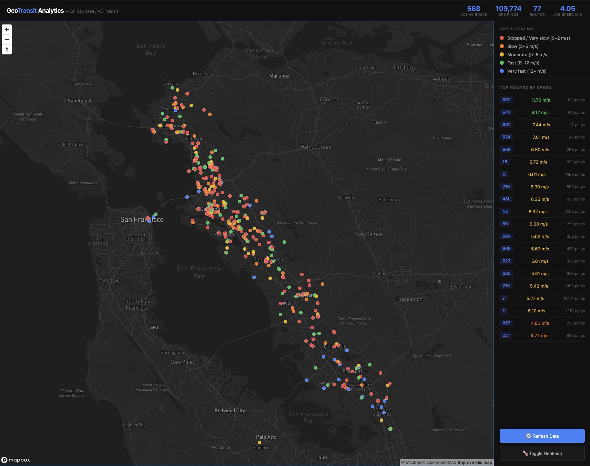

# GeoTransit Analytics

Real-time bus tracking and analytics pipeline for SF Bay Area (AC Transit) — built from scratch to learn production data engineering concepts.


## Live Map Preview



> 568 active AC Transit buses tracked in real time across the SF Bay Area.
> Color coded by speed — red = slow/stopped, orange = moderate, green = fast.

---

## What It Does

Ingests real-time GPS positions from 500+ active AC Transit buses every 5 seconds, validates and transforms each record, stores them in PostgreSQL, and visualizes speed patterns on an interactive MapboxGL map.

- 500+ buses tracked simultaneously across 75 routes
- 109,000+ GPS pings stored per session in PostgreSQL
- Real-time speed analytics — average speed per route, congestion detection
- Color-coded visualization — red=slow, yellow=moderate, green=fast, blue=very fast
- Industry standard data format — GTFS-RT used by TriMet, MTA, CTA worldwide

---

## Architecture
511 SF Bay API (GTFS-RT)
↓
Python Publisher (every 5s)
↓
Redis Message Queue
(local equivalent of GCP Pub/Sub / AWS SQS)
↓
Python Subscriber
(validate + transform + load)
↓
PostgreSQL Database
(breadcrumb + trip tables)
↓
Python REST API
↓
MapboxGL Visualization
---

## Cloud Mapping

| Component | Local | GCP | AWS | Azure |
|---|---|---|---|---|
| Data fetch | Python + requests | Compute Engine + Scheduler | EC2 + EventBridge | AKS + Logic Apps |
| Message queue | Redis | Cloud Pub/Sub | SQS / Kinesis | Service Bus |
| Stream processing | Python consumer | Cloud Functions | Lambda / Glue | Azure Functions |
| Database | PostgreSQL | Cloud SQL | RDS / Redshift | Azure SQL |
| API layer | Python HTTP server | Cloud Run | API Gateway | App Service |
| Visualization | MapboxGL | Same | Same | Same |

---

## Tech Stack

- Python 3.12 — publisher, subscriber, API server
- Redis — message queue (pub/sub pattern)
- PostgreSQL 18 — time-series GPS data storage
- MapboxGL JS — interactive geospatial visualization
- 511 SF Bay API — GTFS-RT real-time vehicle positions

---

## Setup

```bash
git clone https://github.com/Kanishka-Msd/geotransit-analytics
cd geotransit-analytics
python3 -m venv venv
source venv/bin/activate
pip install -r requirements.txt
```

Create .env file:
TRANSIT_511_KEY=your_511_api_key_here
DB_NAME=geotransit
DB_USER=your_username
Get your free API key at: https://511.org/open-data/transit

```bash
psql postgres -c "CREATE DATABASE geotransit;"
psql geotransit < database/setup.sql
```

Run the pipeline:
```bash
# Terminal 1
python3 publisher/fetch_data.py

# Terminal 2
python3 subscriber/process_data.py

# Terminal 3
python3 visualization/api_server.py
open visualization/map.html
```

---

## What I Learned

- Building decoupled pub/sub pipelines with message queues
- GTFS-RT industry standard format for real-time transit data
- PostgreSQL upsert patterns for high-volume streaming data
- Real-time geospatial visualization with MapboxGL
- Data validation strategies that prevent pipeline failures
- How local architecture maps directly to GCP, AWS, and Azure
